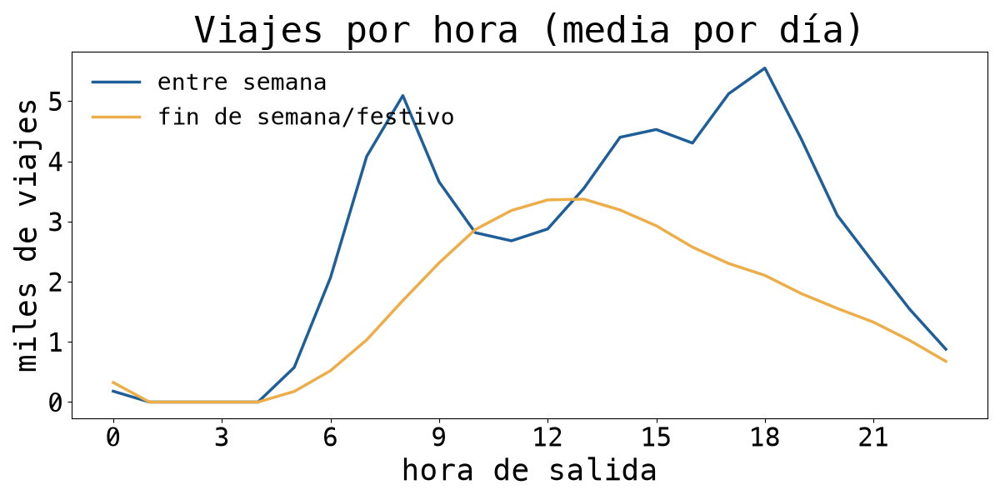
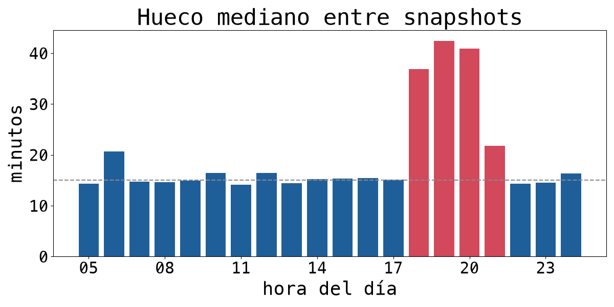
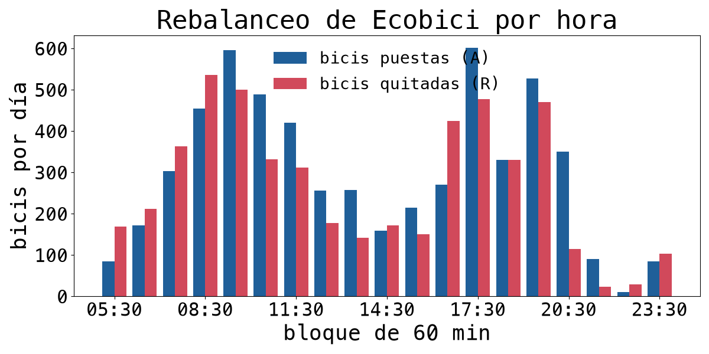
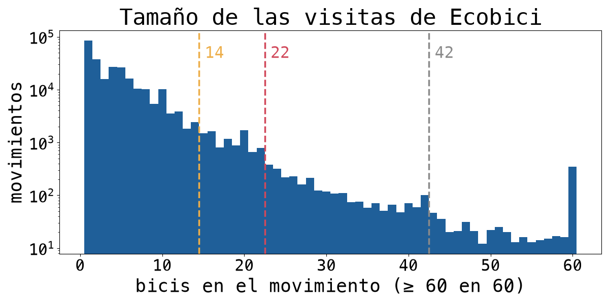
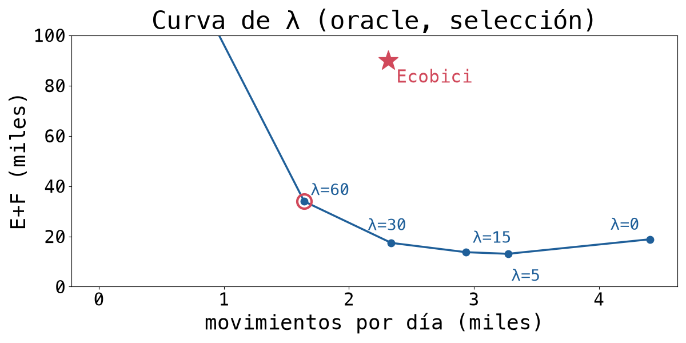
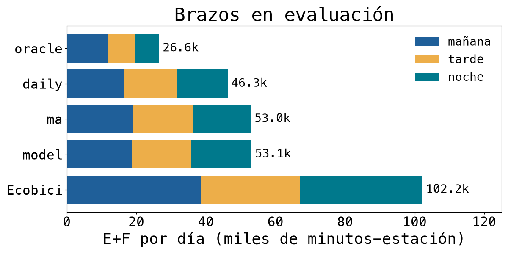

\begin{IEEEkeywords}
bicicletas compartidas, rebalanceo, GBFS, información asimétrica, MILP, horizonte móvil, simulación, Ecobici
\end{IEEEkeywords}

# Contexto

El caso describe una ciudad donde más de 20 millones de personas se mueven en un
sistema fragmentado, y donde casi todo el transporte concesionado opera sin registro. Lo
interpretamos así: el problema útil está donde sí hay datos finos y un operador que
puede actuar con ellos. Ecobici, el sistema de bicicletas públicas de la Ciudad de
México, es el único modo que publica cada viaje (origen, destino, hora y bici) y el estado de
cada estación casi en tiempo real. En 2025 tuvo \nr{d.pordia} viajes por día en promedio,
en \nr{d.estaciones} estaciones.

Ese estado cambia rápido. Las mañanas entre semana vacían las estaciones residenciales y
llenan las de oficinas; en la tarde el patrón se invierte. Para sostener el servicio,
Ecobici *rebalancea*: mueve bicis en camionetas de estaciones con sobra a estaciones con
falta. Lo que se sabe de esa operación es parcial. Hay un equipo que monitorea la
disponibilidad las 24 horas y coordina a "balanceadores" en camionetas con capacidad de
hasta 42 bicis cuando llevan remolque \citep{expansion2026}. El territorio se divide en
123 subzonas de 3 a 5 estaciones y las órdenes llegan por app \citep{mbn2026}. El
gobierno reconoce que 17% de las bicis está fuera de servicio y que el rebalanceo se
reprogramará con "flujos de calor" por polígono \citep{milenio2026}. No son públicos el
número de camionetas, las rutas, los turnos ni la capacidad diaria de la operación.

## Trabajo previo

El *bike rebalancing problem* (BRP) tiene una literatura amplia. En su versión
**estática** (una vez, con el sistema cerrado) se formula como ruteo con inventarios
\citep{raviv2013static, chemla2013, dellamico2014}. Schuijbroek, Hampshire y van Hoeve
\citep{schuijbroek2017} separan dos preguntas: qué inventario necesita cada estación y
qué rutas lo consiguen. Por estación, la insatisfacción esperada como función del
inventario inicial \citep{raviv2013inventory, omahony2015, shu2013} es la idea detrás de
nuestra función de costo. En la versión **dinámica** (durante el día) hay redes
espacio-tiempo \citep{zhang2017timespace}, reglas de prioridad \citep{legros2019},
políticas con *lookahead* sobre demanda simulada \citep{brinkmann2019} y comparaciones
empíricas de estrategias \citep{liang2024}; la demanda estocástica aparece en
\citep{dellamico2018}. El pronóstico de demanda por estación va de modelos jerárquicos
\citep{li2015traffic} a predicción de sobredemanda por clústers \citep{chen2016overdemand}.

Dos líneas tocan la **información incompleta**. La demanda observada está censurada:
nadie renta en una estación vacía \citep{negahban2019}. Y el rebalanceo del operador casi
nunca es público, así que se infiere de datos abiertos, cruzando el estado de las
estaciones con los viajes \citep{medard2016, luo2026}. Luo et al. encuentran, en tres
sistemas de Estados Unidos, que la mayor parte del rebalanceo ocurre de día
\citep{luo2026}. Para Ecobici hay trabajos del ITAM con datos de 2017--2018: ruteo mTSP
y pronóstico por estación \citep{coronado2018}, inventario por simulación-optimización
\citep{gomez2021} e inventario y ruteo con programación lineal y estocástica
\citep{possani2021}.

**Qué hacemos distinto.** Casi toda esta literatura compara su política contra *no hacer
nada* o contra una heurística sintética. Nosotros la comparamos contra el operador real,
medido desde datos públicos y reproducido en el mismo simulador. Eso obliga a
reconstruir el rebalanceo de Ecobici con cuidado (taller, daños, ruido del feed) y
convierte la comparación en la pregunta central del trabajo.

# Definición del problema

**Pregunta.** Con solo la información pública (feed GBFS y viajes), ¿puede una política
que decide cada 15 minutos cuántas bicis poner o quitar en cada estación reducir los
minutos-estación vacíos y llenos respecto a lo que Ecobici hace hoy, con un esfuerzo
comparable y bajo las mismas restricciones observables?

**Por qué importa.** En los 15 días de evaluación, el feed registra en promedio
\nr{v1.Eobs} minutos-estación vacíos y \nr{v1.Fobs} llenos por día, entre 05:30 y
00:30. Una estación vacía es un viaje que no empieza o una caminata a otra
estación; una llena obliga a buscar dónde dejar la bici. Además, Ecobici va a crecer
de 9,308 a 15,000 bicis y de 687 a 1,111 estaciones \citep{milenio2026}, y con más
estaciones el mismo equipo tiene más lugares que atender. La pregunta es alcanzable:
todo lo que usa la política (estado cada 15 minutos, viajes históricos) es público.

**Asimetría.** No conocemos la flota, las rutas, los turnos, la bodega ni el taller.
La tratamos así: (i) inferimos lo que Ecobici hizo, estación por estación, y lo
reproducimos como *replay*; (ii) acotamos nuestro esfuerzo con topes medidos de Ecobici
(movimientos por hora, bicis por movimiento, bodega); (iii) comparamos todo en el mismo
simulador, con los mismos viajes y las mismas dañadas. Así la comparación es lo más
**justa** y lo más **robusta** que permiten los datos. Robusta quiere decir que la
conclusión no cambia en ninguna sensibilidad.

**Alcance.** Decidimos *asignación*: cuántas bicis poner o quitar en cada estación, cada
15 minutos, con efecto una hora después. No decidimos rutas ni camiones. El periodo es
septiembre a noviembre de 2025, en el horario de servicio (05:30--00:30).

**Métrica.** E y F son los minutos-estación con 0 bicis disponibles (E) o con 0
anclajes libres (F), contados minuto a minuto y sin las estaciones fuera de servicio. El
esfuerzo se mide en movimientos (una orden en una estación) y en bicis movidas.

**Hipótesis, formuladas antes de modelar.** H1: Ecobici rebalancea todo el día y no
solo de noche. H2: con pronóstico perfecto, el asignador gana a Ecobici con igual o menor
esfuerzo; si no, el enfoque no sirve. H3: con pronósticos reales también gana.
H4: re-pronosticar durante el día con lo observado mejora contra un pronóstico único de
las 05:30. H5: casi toda la brecha que queda contra el pronóstico perfecto es
error de pronóstico, no del optimizador. Al final reportamos cuáles se sostienen.

# Supuestos

La Tabla \ref{tbl-supuestos} lista los supuestos, por qué valen aquí y qué cambiaría si
fallan. Los marcados con \checkmark{} se verificaron con datos (sección *Resultados y discusión*).

\begin{tabhere}
\caption{Supuestos del planteamiento (P), de los datos (D) y del modelo (M).}
\label{tbl-supuestos}
\scriptsize
\begin{tabularx}{\linewidth}{@{}p{0.4cm}X@{}}
\toprule
 & Supuesto, por qué es válido aquí y qué pasa si cambia \\
\midrule
P1 & E y F pesan igual. Ecobici prioriza vacías en su discurso, pero un usuario que no puede anclar también pierde el viaje. Si E pesara más, se pondera en la función de costo sin cambiar nada más. \\
P2 & Se decide asignación y no rutas, porque la flota no es pública. El esfuerzo se acota con topes medidos de Ecobici. Si la flota real no alcanza, la ventaja se reduce (ver Conclusiones). \\
P3 & Los viajes son exógenos: una salida en una estación vacía se desvía a la más cercana con bici (a $\le 500$ m si la hay) y no se pierde. No modelamos la demanda censurada, así que E subestima el daño real de una vacía \citep{negahban2019}. \\
P4 & Ecobici es lo que inferimos del feed. Es simulador contra simulador, y hay sesgos en los dos sentidos: el replay en $t_0$ y los topes que solo aplican a las políticas favorecen a Ecobici; quitar los pares $\pm 1$ y que la política vea el estado exacto la favorecen a ella. \checkmark{} V1 y las sensibilidades los miden. \\
D1 & El estado del feed es $\sim 30$ s anterior a la hora de su \emph{commit}. \checkmark{} El cuadre stock--viajes es máximo con un desfase de +30 a +36 s. \\
D2 & Todo cambio de stock que no explican los viajes es intervención de Ecobici (sin umbral). Dos toques a una estación en el mismo intervalo se ven como uno. \\
D3 & Un par $\pm 1$ que se deshace en el intervalo siguiente es ruido de sincronía y no rebalanceo. \checkmark{} Son \nr{m.undopct} de los intervalos con cambio; quitarlos casi no mueve E+F. \\
D4 & Las bicis reparadas que vuelven del taller no se distinguen de un "poner" de rebalanceo. Esto infla la bodega medida (632 contra 74 con el taller dentro); ver la sensibilidad. \\
D5 & Una estación que reporta todo en cero está fuera de servicio. \checkmark{} No hay viajes mientras reporta en blanco. \\
D6 & Sep--nov 2025 es representativo de un día normal (sin vacaciones de verano ni diciembre). Diciembre 2025 está sellado como reserva y no se leyó. \\
M1 & Para decidir, la demanda es un flujo fluido con tasa uniforme dentro de cada bloque de 60 min. \checkmark{} El costo sustituto ordena los planes como el simulador (Spearman mediana \nr{val.spearman}). \\
M2 & Una orden tarda $L=60$ min en hacerse efectiva. Sensibilidad con 45 y 30. \\
M3 & El asignador ve el estado exacto cada 15 min, como lo da el feed en vivo. \\
M4 & Las dañadas, los daños y el taller son eventos exógenos, iguales en todos los brazos. \checkmark{} El simulador sigue a las dañadas del feed con error de \nr{v1.danmae} por estación. \\
\bottomrule
\end{tabularx}
\end{tabhere}

# Resultados y discusión

## Datos

Usamos tres fuentes. (i) **Viajes**: datos abiertos de Ecobici \citep{ecobici_datos},
enero a noviembre de 2025; cada renglón trae bici, estación y hora de salida y de
llegada. (ii) **Feed GBFS en vivo** \citep{gbfs}: el estado de cada estación
(bicis disponibles, dañadas, anclajes libres y deshabilitados, `is_renting`). El feed
declara `ttl` de 10 s y, en una muestra del 29 de septiembre de 2026, `last_updated`
avanzó cada \mbox{$\sim 10$--11 s}. La app lo lee en vivo. (iii) **Histórico del feed**:
**agradecemos a Max Halford**, cuyo repositorio `bike-sharing-history`
\citep{halford_bsh} consulta desde 2023 los feeds de decenas de sistemas, "aproximadamente
cada 12 minutos" según su README, y publica archivos mensuales. Los de Ecobici empiezan
en abril de 2024. Sin ese archivo no habría forma de saber qué hizo Ecobici en el pasado.
Usamos agosto a noviembre de 2025 en la ventana 05:00--01:00: \nr{f.renglones}
renglones en \nr{f.dias} días. **Diciembre de 2025 está sellado para el experimento
final**: se reservó como conjunto de prueba final y ningún código de la tubería
`ecosim` lo puede leer (el 30 de noviembre también queda fuera, porque su ventana llega
al 1 de diciembre). Un análisis exploratorio anterior y ajeno a esta tubería sí abarcó
2025--2026; se identifica explícitamente abajo y no se usó para seleccionar ni evaluar
modelos.

**Checks de validación (lo primero que hicimos).** La Tabla \ref{tbl-checks} resume los
datos, recalculados con `report/figs/checks_datos.py`. Los archivos de viajes están
particionados por mes de llegada, sin duplicados ni timestamps inválidos. Los viajes usan 677
estaciones con identificador numérico, como el feed (677 a 679 por día); solo dos
identificadores no numéricos (una estación temporal y el `1000`) quedan fuera.

\begin{tabhere}
\caption{Checks de los datos (viajes ene--nov 2025; feed ago--nov 2025).}
\label{tbl-checks}
\scriptsize
\begin{tabularx}{\linewidth}{@{}Xr@{}}
\toprule
Viajes (ene--nov 2025) & \nr{d.viajes} \\
Estaciones / bicis distintas & \nr{d.estaciones} / \nr{d.bicis} \\
Viajes por día: media (mediana) & \nr{d.pordia} (\nr{d.pordiamed}) \\
\quad entre sem. / fin de sem. / festivo & \nr{d.wd} / \nr{d.we} / \nr{d.hol} \\
\quad mín. (\nr{d.pordiamindia}) / máx. (\nr{d.pordiamaxdia}) & \nr{d.pordiamin} / \nr{d.pordiamax} \\
Viajes por semana (\nr{d.nsem} completas) & \nr{d.sem} \\
\quad mínimo / máximo & \nr{d.semmin} / \nr{d.semmax} \\
Máx. viajes en una hora (\nr{d.maxhoraen}) & \nr{d.maxhora} \\
Duración: mediana / p95 (min) & \nr{d.durmed} / \nr{d.durp95} \\
Viajes/día 00:00--00:30 / 00:30--05:00 & \nr{d.v0000} / \nr{d.v0030} \\
\midrule
Commits del feed por día (05:00--01:00) & \nr{f.commits} \\
Hueco entre snapshots, mediana / p90 (min) & \nr{f.huecomed} / \nr{f.huecop90} \\
\quad mediana 18:00--21:59 / resto del día & \nr{f.hueco1821} / \nr{f.huecoresto} \\
Rentan: 00:00--00:30 / 00:30--01:00 & \nr{f.rentapre} / \nr{f.rentapost} \\
Disponibles: antes / después de 00:30 & \nr{f.disppre} / \nr{f.disppost} \\
\bottomrule
\end{tabularx}
\end{tabhere}

Tres hallazgos guían el modelado. (1) Entre semana hay dos picos, a las 8 y a las
18 h, con \nr{d.picowd} salidas por hora a las \nr{d.picowdh} h; el fin de semana tiene
un solo pico al mediodía (Figura \ref{fig-horas}). Por eso los pronósticos distinguen
el tipo de día. (2) **A las 00:30 el sistema cierra**: el feed pasa a no rentar
(\nr{f.rentapost} de las estaciones rentan después de las 00:30, contra \nr{f.rentapre}
antes) y reporta las bicis ancladas como dañadas (\nr{f.danpre} $\to$ \nr{f.danpost}).
Entre 00:30 y 05:00 hay \nr{d.v0030} viajes por día. Esto fija la ventana en
05:30--00:30. (3) El recolector es irregular de 18:00 a 21:59: el hueco mediano entre
snapshots sube de \nr{f.huecoresto} a \nr{f.hueco1821} min (Figura \ref{fig-feed}).
Por eso la cobertura de un día se mide con bloques de 60 min (se exige $\ge 90$%) y no de
15. Además, esa franja es donde la medición de Ecobici es menos precisa.

{#fig-horas width=100%}

{#fig-feed width=100%}

## Cómo medimos el rebalanceo de Ecobici

**Primer enfoque: seguir cada bici.** Si una bici termina un viaje en la estación A y
su siguiente viaje sale de B $\ne$ A, alguien la movió. Así contamos 2.78 millones de
"saltos" en un análisis exploratorio anterior al experimento, sobre ene-2025--ago-2026
(`wiki/Rebalanceo-Ecobici-suposicion-horario.md`). Ese conteo incluye el mes reservado
y por ello solo motiva el método: no entra en los datos, parámetros ni resultados del
run 2.
El método tiene dos fallas de fondo. Solo sabemos que la bici se movió entre su llegada a A
y su siguiente salida de B; si nadie la toma pronto, no sabemos *cuándo* llegó (el hueco
mediano es de 2.3 h). Y nunca vemos las bicis que Ecobici mete desde bodega o taller,
porque no tienen viaje anterior.

**Enfoque final: inferencia por estación.** Entre dos snapshots consecutivos $t_0<t_1$
de la estación $i$,
$$\delta_i = s_i(t_1) - s_i(t_0) - \text{llegadas}_i(t_0,t_1] + \text{salidas}_i(t_0,t_1],$$
con $s$ = disponibles + dañadas, para que una bici que se marca dañada no parezca
retirada. Todo $\delta\neq0$ es una intervención de Ecobici (regla 1.3 del plan del run
1). Cuatro correcciones, cada una medida:

- **Hora.** El feed no trae `last_reported`. Al barrer desfases entre el reloj del
  feed y el de los viajes, el cuadre es máximo con +30 a +36 s, así que la hora de cada
  snapshot es la del commit menos 30 s.
- **Taller, daños y reparaciones.** Con $\Delta d$ = cambio de dañadas: un aumento es
  *daño*; una baja con $\delta<0$ es *taller* (Ecobici se lleva dañadas) hasta
  $\min(-\Delta d,-\delta)$, y el resto es *reparación en sitio*. El rebalanceo es
  $\delta^{\text{reb}} = \delta + \text{taller}$. En promedio hay \nr{m.danos} daños,
  \nr{m.rep} reparaciones y \nr{m.taller} bicis al taller por día. Los daños y el taller
  pasan al simulador como eventos exógenos.
- **Pares $\pm 1$ que se deshacen.** Un $+1$ seguido de un $-1$ en el intervalo
  siguiente (o al revés) es desfase entre relojes, no un camión. Son \nr{m.undopct} de
  los intervalos con cambio y se excluyen de la medición principal.
- **Cierre de las 00:30.** El intervalo que cruza el cierre no genera movimientos.

En \nr{m.dias} días medidos, Ecobici hace \nr{m.movs} movimientos por día
(\nr{m.movsundo} con los pares $\pm 1$), mete \nr{m.A} bicis y saca \nr{m.R}. **H1 se
confirma** (Figura \ref{fig-rebal}): \nr{m.pctman} de los movimientos ocurren de 05:30 a
12:30, \nr{m.pcttar} de 12:30 a 18:30 y \nr{m.pctnoc} de 18:30 a 00:30. Hay picos a las
08:30--10:30 y a las 17:30. Esto corrige un supuesto que usamos al principio
(`wiki/Rebalanceo-Ecobici-suposicion-horario.md`): que el rebalanceo era sobre todo
nocturno. Coincide con lo que reportan Luo et al. para otros sistemas \citep{luo2026}.

{#fig-rebal width=100%}

## Decisiones tomadas con datos

La Tabla \ref{tbl-decisiones} resume cada parámetro con su número y su fuente. Tres
merecen detalle.

**Tope de bicis por movimiento (14/22/42).** 42 es la capacidad de una camioneta con
remolque \citep{expansion2026}: el único límite físico público. 14 y 22 salen de las
visitas de Ecobici. Lo recalculamos en `report/figs/rebalanceo_ecobici.py`. **En la
mañana del run 1** (05:30--12:30, 15 días de evaluación, sin pares $\pm 1$), 14 es el
**p95** y 22 el **p99** exactos: la creencia de partida es correcta para esa medición.
**En el día completo del run 2**, con la medición principal (sin taller y sin $\pm 1$),
el p95 sigue en \nr{bpm.r2.p95} pero el p99 es \nr{bpm.r2.p99}: 22 queda en el
percentil \nr{bpm.r2.rank22}. Solo \nr{bpm.r2.gt42} de las visitas de Ecobici pasa de
42 (Figura \ref{fig-bpm}). Se usó 22 como principal y 14 y 42 como sensibilidad.

{#fig-bpm width=100%}

**Topes por hora (\nr{m.topehora}) y de bodega (\nr{m.bodega}).** El tope por hora es
el p95 de los movimientos de Ecobici en ventanas móviles de 60 min (mediana
\nr{m.topehoramed}, máximo \nr{m.topehoramax}, un día atípico). La bodega es el promedio
diario de $|A-R|$ del rebalanceo: \nr{m.bodegamean}, positivo los \nr{m.bodegapos} días.
Su limitación es seria. Con el taller dentro, $A-R$ es \nr{m.stockAR} por día y el tope
sería \nr{m.bodegataller}. La diferencia son reparadas que vuelven y que no podemos
distinguir de bicis de bodega (D4). Por eso reportamos ambos.

**λ por Kneedle.** λ es el costo, en minutos-estación, de cada movimiento. Se eligió
con Kneedle \citep{satopaa2011kneedle} sobre la curva E+F contra movimientos del oracle en
días de selección: λ = \nr{sel.lam}. Pero λ **es una decisión operativa, no un
parámetro estadístico** (Figura \ref{fig-lambda}). Con λ = 5, el oracle da \nr{lam.5.EF}
de E+F con \nr{lam.5.moves} movimientos; con λ = 60 da \nr{lam.60.EF} con
\nr{lam.60.moves}. Es decir, \nr{der.lamratio} veces menos E+F moviendo \nr{der.lammoves} veces más. A **igual número de
movimientos que Ecobici** (\nr{selEco.moves} por día en selección), λ = 30 hace
\nr{lam.30.moves} movimientos y deja \nr{lam.30.EF} de E+F, contra \nr{selEco.EF} de
Ecobici en los mismos días. El λ correcto depende de cuántas visitas por hora
puede hacer la flota real, que no conocemos. λ bajo también cuesta cómputo: con λ = 5 una
decisión llegó a tardar \nr{time.lam5sel} s, contra \nr{time.mainmax} s como máximo en los
brazos principales.

{#fig-lambda width=100%}

\begin{tabhere}
\caption{Parámetros, su valor y de dónde salen.}
\label{tbl-decisiones}
\scriptsize
\begin{tabularx}{\linewidth}{@{}lrX@{}}
\toprule
Decisión & Valor & Evidencia \\
\midrule
Ventana & 05:30--00:30 & cierre a las 00:30 (Tabla \ref{tbl-checks}) \\
Días & 15 + 15 & selección y evaluación, estratificados 11 entre semana + 4 fin de semana; cobertura $\ge 90$\% \\
Bicis por movimiento & 22 (14, 42) & p99/p95 de Ecobici (mañana); 42 = camioneta \\
Tope por hora & \nr{m.topehora} & p95 de Ecobici sin $\pm 1$ (con $\pm 1$: \nr{m.topehoraundo}) \\
Bodega & \nr{m.bodega} (74) & $\lceil$media $|A-R|\rceil$ sin taller (con taller) \\
Dañadas & dinámicas & \nr{m.eventos} eventos del feed \\
Cota de retiro & $\lfloor p-\sigma\rfloor$ & mejor en \nr{sel.retirogana} de \nr{sel.retirode} pares (λ, día) de selección \\
λ & \nr{sel.lam} & Kneedle sobre el oracle (selección) \\
$h$, $f$ & por brazo & rejilla en selección (Tabla \ref{tbl-hsel}) \\
$L$ & 60 min & principal; 45 y 30 como sensibilidad \\
\bottomrule
\end{tabularx}
\end{tabhere}

## Método

**Simulador viaje por viaje** (`ecosim/sim.py`). Arranca con el estado real de las
05:30 y nunca vuelve a leer el stock real: el estado cambia solo con los viajes, los
eventos de dañadas y las órdenes. Una salida en estación vacía se desvía a la estación
más cercana con bici (a $\le 500$ m si la hay); una llegada a estación llena, a la más
cercana con lugar; ningún viaje se pierde. Cada orden se recorta a lo físicamente
posible, a 22 bicis y a la bodega. El mismo motor y la misma métrica sirven para todos
los brazos. El replay de Ecobici aplica $\delta^{\text{reb}}$ al inicio de cada
intervalo ($t_0$), lo que lo favorece; con $t_1$ como sensibilidad.

**Pronósticos** de salidas y llegadas por estación y bloque de 60 min
(`ecosim/pronostico.py`). **oracle**: los conteos reales del día (techo).
**daily**: media de los días del mismo tipo (entre semana o fin de semana/festivo) de las 4 semanas anteriores,
emitida una sola vez a las 05:30 para todo el día. **ma**: la misma base, re-emitida
cada $f\in\{15,60,180\}$ min y corregida con lo observado en el día,
$\text{factor}=\text{clip}\big((\text{obs}+5)/(\text{pred}+5),0.5,2\big)$ por estación y
dirección (el 5 se fijó antes de ver resultados). **model**: dos LightGBM Poisson
\citep{ke2017lightgbm} (salidas y llegadas) con estación (categórica), bloque, día de la
semana, festivo, rezagos de 7 y 14 días y media de 28 días del mismo tipo de día. Se
entrenan con 2025-01-01 a 2025-08-31, sin tunear (200 árboles, tasa 0.05, 31 hojas), y
llevan la misma corrección. Un test verifica que ninguna emisión use datos posteriores a
su hora.

**Asignador** (`ecosim/asignador.py`): MILP resuelto con HiGHS
\citep{huangfu2018highs} en horizonte móvil. En cada $t$ (cada 15 min) proyecta con un
flujo fluido las bicis $p_i$ que habrá en $t+L$. Para cada objetivo entero $y$ calcula
el costo $c_i(y)$: minutos vacíos más llenos en $[t+L,t+L+h)$ si la estación arranca con
$y$ bicis. Luego resuelve
\begin{align*}
\min\ & \textstyle\sum_i z_i + \lambda\sum_i m_i + \mu\, w\\
\text{s.a. }& z_i \ge c_i(a) + \beta_{ik}(y_i-a) \quad \text{(envolvente convexa de } c_i)\\
& y_i-\hat p_i \le u_i m_i,\quad \hat p_i-y_i \le r_i m_i\\
& w \ge \pm\textstyle\sum_i (y_i-\hat p_i),\quad \textstyle\sum_i m_i \le M_t\\
& \ell_t \le \textstyle\sum_i (y_i-\hat p_i) \le h_t,\ \ y_i\in\mathbb Z,\ m_i\in\{0,1\}
\end{align*}
con $\hat p_i=\text{round}(p_i)$ y las cotas por orden
$r_i=\min(\lfloor p_i-\sigma_i\rfloor,22)$ y $u_i=\min(K_i-\lceil p_i+\sigma_i\rceil,22)$.
Aquí $\sigma_i$ es la desviación Poisson del flujo esperado en $[t,t+L)$ y $K_i$ son las
bicis más los anclajes libres. $M_t$ es el tope por hora menos lo ya ordenado en las
ventanas de 60 min que contienen a $t+L$, y $[\ell_t,h_t]$ mantiene la bodega acumulada
en $\pm$\nr{m.bodega}. La orden es $x_i=y_i-\hat p_i$, efectiva en $t+L$. El detalle
está en el Apéndice \ref{app-form}. En \nr{runs.decisions} decisiones del run 2 no hubo ninguna sin
solución factible, y una decisión tarda \nr{runs.dec_s} s en promedio.

**Protocolo.** Todo lo elegible (cota de retiro, λ, $h$ y la frecuencia $f$ de cada
brazo) se eligió en 15 días de **selección** y se congeló. Los resultados son de otros
15 días de **evaluación** (los del run 1). La métrica principal es E+F medio por día;
también contamos en cuántos de los 15 días cada brazo le gana a Ecobici.

## Validación del simulador (V1)

Con el replay de Ecobici, el simulador reproduce E dentro de \nr{v1.Eman} y F dentro de
\nr{v1.Fman} en la mañana (diferencia absoluta media por día), y F dentro de \nr{v1.F}
en el día. El error de stock es de \nr{v1.stockmae} bicis por estación. En E del día
completo queda \nr{v1.E} abajo; en la tarde, \nr{v1.Etar}, y en la noche, \nr{v1.Enoc}.
El 42% del faltante cae de 17:30 a 21:30: desde las 18:00 el recolector deja huecos de
20--45 min, y el replay en $t_0$ aplica cada movimiento al inicio del hueco, hasta 44 min
antes de lo real. Con $t_1$, E queda en \nr{v1.t1E}. **Los sesgos van en los dos
sentidos.** A favor de Ecobici: el replay en $t_0$ le baja E+F (con $t_1$ sube
\nr{rep.t1pct}, a \nr{rep.t1}), y la bodega y los topes solo limitan a las políticas. En
su contra: quitar los pares $\pm 1$ le sube \nr{rep.undopct} (con ellos da \nr{rep.undo}),
y la política ve el estado exacto. El error que queda con $t_1$ es del simulador y afecta
a todos los brazos, sin dirección probada sobre la brecha. Las dañadas dinámicas
arreglaron la falla del run 1: con dañadas fijas, E se desviaba \nr{v1.fijasEman} en la
mañana.

## Selección fuera de muestra

La Tabla \ref{tbl-hsel} muestra E+F en selección según $h$ (cuántas horas mira el
asignador, igual al horizonte del pronóstico). El oracle mejora hasta $h$ = 5 y `ma`
(re-emitido cada hora) hasta $h$ = 3; se buscó hasta $h_{\max}$ = \nr{sel.hmax}. En la
rejilla $(f,h)$, las mejores configuraciones fueron: `daily` con $h$ =
\nr{sel.daily.H} (\nr{sel.daily.EF}), `ma` con $f$ = \nr{sel.ma.f}, $h$ = \nr{sel.ma.H}
(\nr{sel.ma.EF}) y `model` con $f$ = \nr{sel.model.f}, $h$ = \nr{sel.model.H}
(\nr{sel.model.EF}). **H4 se rechaza.** El mejor brazo real es `daily`, que no
re-pronostica. La exactitud lo explica: sobre las mismas decisiones, el MAE por
estación-bloque de salidas es 2.053 con `daily` y 2.10 con `ma` re-emitido
(`ecosim/results/pronostico/REPORT.md`). Con conteos tan chicos (WAPE $\approx$ 0.45),
el factor por estación agrega más ruido que señal.

\begin{tabhere}
\caption{E+F medio por día en selección (miles) según $h$.}
\label{tbl-hsel}
\input{tablas/hsel.tex}
\end{tabhere}

\begin{figure*}[t]
\centering
\includegraphics[width=0.49\textwidth]{figs/app/01-mapa-en-vivo.png}\hfill
\includegraphics[width=0.49\textwidth]{figs/app/02-replay-decisiones.png}\\[4pt]
\includegraphics[width=0.49\textwidth]{figs/app/03-prediccion-en-vivo.png}\hfill
\includegraphics[width=0.49\textwidth]{figs/app/04-prediccion-que-tan-bueno.png}
\caption{La app. Arriba a la izquierda: \emph{Bicis ahora}, el feed en vivo. Arriba a la derecha: \emph{Replay} del 3 de septiembre de 2025 a las 08:45 con el mejor brazo real (\texttt{daily}): órdenes del asignador, movimientos de Ecobici, insumos de la decisión y E+F acumulado. Abajo: \emph{Predicción} con \texttt{daily}, el default final, sobre el feed real del 29 de septiembre de 2026 a las 17:30: qué mover ahora (232 movimientos, efectivos a las 18:30), estaciones en riesgo, de dónde sale cada número, viajes esperados y ``qué tan bueno sería'' (22 corridas ya evaluadas).}
\label{fig-app}
\end{figure*}

## Brazos contra Ecobici (evaluación)

\begin{table*}[t]
\centering\small
\caption{E+F por día en evaluación (miles de minutos-estación) por franja: mañana 05:30--12:30, tarde 12:30--18:30, noche 18:30--00:30. ``Gana'' = días con menos E+F que Ecobici. Bicis = miles movidas por día.}
\label{tbl-brazos}
\setlength{\tabcolsep}{5pt}
\input{tablas/brazos.tex}
\end{table*}

**H2 y H3 se confirman** (Tabla \ref{tbl-brazos}, Figura \ref{fig-brazos}). Todos los
brazos le ganan a Ecobici los 15 días. `daily` baja E+F \nr{arm.daily.vseco} (entre
\nr{arm.daily.rmin} y \nr{arm.daily.rmax} según el día) con \nr{arm.daily.moves}
movimientos y \nr{arm.daily.bikes} bicis por día, contra \nr{arm.eco.moves} y
\nr{arm.eco.bikes} de Ecobici: un esfuerzo comparable (\nr{der.dailymovs} más movimientos, \nr{der.dailybikes} más
bicis). El oracle baja \nr{arm.oracle.vseco} con menos movimientos que Ecobici. `ma` y
`model` ganan menos que `daily`, mueven más y saturan la bodega (recortan
\nr{arm.ma.recbod} bicis por día, contra \nr{arm.daily.recbod} de `daily`); en una medición de
integración en 4 días, la bodega explica cerca de un tercio de esa brecha. Con $L$ = 30 min todo mejora: oracle
\nr{L30.oracle}, `model` \nr{L30.model}.

{#fig-brazos width=100%}

**H5 se confirma en parte.** Entre `daily` y el oracle quedan \nr{gap.daily.oracle}
minutos-estación por día, y con el mismo optimizador la única diferencia es el
pronóstico. Pero el oracle tampoco llega a cero, por razones que no son de
pronóstico. La primera hora es intocable, porque la primera orden llega a las 06:30
(\nr{df.h0}, el \nr{df.h0pct} del oracle). Y los hubs no alcanzan con una o dos visitas
por hora.

**Sensibilidades** (Tabla \ref{tbl-sens}). `daily` gana los 15 días en todas. Lo que
más mueve el resultado es la bodega: con el tope de 74 (taller dentro), `daily` sube a
\nr{sens.sens_bodega_taller.daily}. Le siguen el tope por movimiento (14: \nr{sens.sens_mm14.daily})
y la cota de retiro. El tope por hora no aprieta: con 474, E+F cambia a lo más \nr{der.tope474}.
λ = 5 ayuda mucho al oracle (\nr{sens.sens_lam_min_seleccion.oracle}) pero casi nada a
`daily` (\nr{sens.sens_lam_min_seleccion.daily} con \nr{sens.sens_lam_min_seleccion.daily.moves}
movimientos): con pronóstico imperfecto, las visitas extra persiguen ruido.

\begin{tabhere}
\caption{Sensibilidades en evaluación: E+F (miles) y movimientos por día.}
\label{tbl-sens}
\setlength{\tabcolsep}{2.5pt}\scriptsize
\resizebox{\linewidth}{!}{\input{tablas/sensibilidades.tex}}
\end{tabhere}

**Dónde falla.** Las 20 peores combinaciones estación $\times$ hora de `daily` suman solo
\nr{df.top20pct} de su E+F: la falla está repartida. Destacan los hubs de la mañana
(273-274, 271-272, 268-269 y 176 a las 07:30--08:30) y los vaciados de las 17:30--18:30
(261, 014, 022). En 273-274 a las 07:30, `daily` acumula \nr{df.hub.EF} y el oracle
\nr{df.hub.EF_oracle}, contra \nr{df.hub.EF_ecobici} de Ecobici. Ahí Ecobici opera una
zona *valet* \citep{mbn2026} con recargas continuas; nuestro pronóstico se queda corto en
la punta (\nr{df.hub.sal_pron} salidas pronosticadas contra \nr{df.hub.sal_real}
reales), y la estación estuvo vacía algún momento en \nr{df.hub.dias_censurado} de los
15 días, así que la demanda observada está censurada.

**Comparación con el run 1.** El run 1 usó 05:30--12:30, dañadas fijas, bodega ilimitada,
sin tope por movimiento y parámetros elegidos en los mismos días en que se evaluó. En la misma
mañana, el run 2 da oracle \nr{arm.oracle.manana} (run 1: \nr{run1.oracle}) y `daily`
\nr{arm.daily.manana} (run 1: \nr{run1.daily}), con reglas más estrictas y elección
fuera de muestra (Tabla \ref{tbl-run1}, Apéndice \ref{app-run1}). El replay de Ecobici con la regla del
run 1 da exactamente los mismos \nr{run1.ecobici}, y con la medición justa sube a
\nr{arm.eco.manana}. Juntas, las decisiones del run 1 le daban al asignador \nr{der.run1min}--\nr{der.run1max}\% menos E+F en la mañana
(oracle \nr{sens.diag_como_run1.oracle.manana}, `daily` \nr{sens.diag_como_run1.daily.manana}).

## Producto: la app

La app materializa el análisis para quien opera y para quien usa Ecobici
(Figura \ref{fig-app}). Es un solo servicio (FastAPI + MapLibre, `scripts/ecobici_mapa/`).
El código, la app y las instrucciones de instalación y ejecución están en el repositorio
público del proyecto \citep{repo}. Tiene tres pestañas centrales:

- **Bicis ahora**: las 677 estaciones con el feed GBFS en vivo, con bicis, estaciones
  sin bicis y sin lugar.
- **Replay**: para cada día de evaluación y cada brazo, rehace el día con el mismo
  motor y los parámetros congelados, y muestra cada 15 min el estado, los viajes, las
  órdenes del asignador (decididas y efectivas), los movimientos de Ecobici, los insumos
  de la decisión y el E+F acumulado contra Ecobici y sin rebalanceo. El E+F final de
  cada día y brazo coincide con `resultados.csv` (90 de 90 corridas, tolerancia 0).
- **Predicción**: con el feed real del día, qué mover ahora, qué estaciones están en
  riesgo y cuántos viajes se esperan; cuando pasa el horizonte, compara lo pronosticado
  contra lo observado en el feed y muestra el error acumulado. En 22 corridas evaluadas
  del 29 de septiembre con `daily`, el MAE a 0 h fue de $\approx 2.2$ salidas y 2.0
  llegadas por estación-hora (hasta 2.4/2.2 a 3 h).

**Pipeline en vivo.** Un hilo del servidor lee el feed cada 60 s y lo guarda; cada
15 min arma el estado, pronostica con `daily` por defecto (el mejor brazo real del reporte; `ma`
queda en el selector) y corre el asignador
con los parámetros congelados (λ = \nr{sel.lam}, cota $\sigma$, $L$ = 60 min, topes
\nr{m.topehora}/h, bodega $\pm$\nr{m.bodega}, $\le 22$ bicis por movimiento). Como los
viajes abiertos llegan a agosto de 2026, la base del pronóstico en vivo usa las 4
semanas que terminan el 30 de agosto de 2026, del mismo tipo de día.

# Conclusiones y recomendaciones

**Respuesta.** Sí. Con solo datos públicos, una política de asignación cada 15 minutos
con un pronóstico sencillo (el promedio de las 4 semanas anteriores, emitido a las 05:30)
reduce E+F \nr{arm.daily.vseco} contra lo que Ecobici hizo, con un esfuerzo comparable.
Gana los 15 días de evaluación y en todas las sensibilidades. Es un resultado de
simulador, no un ahorro en la calle; la comparación es justa en todo lo que los datos
permiten ver, y los sesgos que quedan son chicos frente a la brecha (el mayor, la hora del
replay, mueve a Ecobici \nr{rep.t1pct}, contra una ventaja de \nr{arm.daily.vseco}).

**Recomendaciones para Ecobici, en orden de prioridad.**

1. **Piloto de asignación con el pronóstico `daily` en una microzona.** Es barato: usa
   el feed y los viajes que Ecobici ya tiene, y cada decisión tarda \nr{runs.dec_s} s en promedio (\nr{time.mainmax} s como máximo).
   Encaja con sus órdenes por app en 123 subzonas \citep{mbn2026}. Medir E+F antes y
   después contra zonas testigo.
2. **Reducir el tiempo entre la decisión y la ejecución.** Pasar de 60 a 30 min baja
   E+F \nr{der.L30min}--\nr{der.L30max}\% en nuestros brazos; es la palanca operativa más grande que medimos.
3. **Fijar λ por capacidad operativa, no por un codo estadístico.** λ traduce "cuánto
   vale una visita". Con los datos de flota (camionetas por turno, visitas por hora), λ se
   calibra para usar exactamente esa capacidad.
4. **Separar taller y bodega en los datos que publica Ecobici.** La bodega es la
   sensibilidad que más mueve el resultado, y no la podemos medir bien (632 contra 74).
5. **No invertir primero en re-pronosticar ni en modelos complejos.** Re-emitir cada
   15 min con corrección por estación no ayudó; `model` no le ganó a `daily`.

**Supuestos que cambiarían las recomendaciones.** Si la flota real no puede hacer
\nr{arm.daily.moves} visitas diarias con picos de hasta \nr{m.topehora} por hora, la ventaja se reduce. Si la
bodega real se acerca a 74, `daily` sube \nr{der.bodtaller} y sigue ganando los 15 días. Si E importa más que F, hay
que ponderar. Si la demanda censurada es grande en los hubs, el pronóstico subestima
justo donde más importa.

**Limitaciones y siguientes pasos.** (i) Correr un año completo, con temporadas y
vacaciones, y abrir la reserva de diciembre como prueba final. (ii) Re-entrenar el modelo
por ventanas móviles y probar un factor intradía global, no por estación. (iii) Estimar
la demanda censurada en hubs \citep{negahban2019}. (iv) Agregar ruteo con una flota
parametrizada \citep{schuijbroek2017} para verificar que las órdenes son ejecutables.
(v) Mejorar el replay de la noche con un feed más fino de 17:30 a 21:30. (vi) Decidir el
estado de las 05:30 (rebalanceo nocturno), que hoy nadie controla en el simulador.

## Uso de IA generativa

El código (`ecosim/`), los análisis y este reporte (repositorio \citep{repo}) se hicieron con agentes de Claude Code
(Anthropic) bajo la dirección del autor. Cada módulo pasó por una revisión independiente
hecha por otro agente. Cada número del reporte sale de un archivo o de un
cálculo reproducible (`report/fuentes-numeros.md`); las citas se verificaron contra
Crossref o contra la fuente.

# Agradecimientos {.unnumbered}

A Max Halford, por mantener `bike-sharing-history` \citep{halford_bsh}: sin su archivo
histórico del feed no se podría medir lo que Ecobici hizo en el pasado.

\bibliography{referencias}

\appendices

# Formulación del asignador {#app-form}

Sea $\mathcal I$ el conjunto de estaciones y $t$ la hora de decisión (05:30, 05:45,
\ldots; sin órdenes con $t+L\ge$ 00:30). Del estado en $t$ se toman $b_i$ bicis
disponibles y $K_i=b_i+\text{libres}_i$ (las dañadas y los anclajes deshabilitados no
cuentan). La emisión de pronóstico más reciente con hora $\le t$ da tasas por minuto
$d_{i\tau}$ (salidas) y $a_{i\tau}$ (llegadas), uniformes en cada bloque de 60 min.

**Proyección.** $s_{i,\tau+1}=\text{clip}_{[0,K_i]}(s_{i\tau}+a_{i\tau}-d_{i\tau}+o_{i\tau})$
desde $s_{it}=b_i$ hasta $t+L$, con $o$ las órdenes pendientes; $p_i=s_{i,t+L}$ y
$\hat p_i=\text{round}(p_i)$.

**Costo por estación.** Para $y\in\{0,\ldots,K_i\}$, se corre el mismo flujo desde
$s_{i,t+L}=y$ hasta $t+L+h$ y
$c_i(y)=\sum_{\tau}\mathbf 1[s_{i\tau}<0.5]+\mathbf 1[s_{i\tau}>K_i-0.5]$. Sobre el rango
permitido $[\hat p_i-r_i,\hat p_i+u_i]$ se usa la envolvente convexa inferior
$\hat c_i$, con vértices $a_0<\ldots<a_n$ y pendientes
$\beta_{ik}=(c_i(a_{k+1})-c_i(a_k))/(a_{k+1}-a_k)$, lo que hace lineal el objetivo.

**Cotas.** $\sigma_i=\big(\sum_{\tau\in[t,t+L)}(d_{i\tau}+a_{i\tau})\big)^{1/2}$,
$r_i=\text{clip}_{[0,\hat p_i]}\min(\lfloor p_i-\sigma_i\rfloor,22)$ y
$u_i=\text{clip}_{[0,K_i-\hat p_i]}\min(K_i-\lceil p_i+\sigma_i\rceil,22)$; las
estaciones fuera de servicio tienen $r_i=u_i=0$. Tope por hora:
$M_t=246-\max_{V\ni t+L}|\{\text{órdenes con efecto en }V\}|$, sobre ventanas $V$ de
60 min que empiezan cada 15 min. Bodega: con $W$ = $A-R$ aplicado hasta $t$ y
$P$ = suma de pendientes, $\ell_t=\min(-632-W-P,0)$ y $h_t=\max(632-W-P,0)$.

**Solución.** HiGHS con brecha relativa $10^{-4}$. Si no hay solución factible, no se
mueve nada y se registra (0 casos en el run 2). $\mu$ = 1 minuto-estación por bici de
bodega (sensibilidad $\mu$ = 0).

**Validación del sustituto.** En 72 decisiones (3 días de selección $\times$ 8 horas
$\times$ $h\in\{1,3,6\}$), la correlación de Spearman entre el costo sustituto y E+F de un
simulador de flujo, sobre 23 planes por decisión, tiene mediana \nr{val.spearman} y es
$\ge 0.8$ en \nr{val.nge} de \nr{val.n} (`ecosim/results/asignador/REPORT.md`).

# Run 1 contra run 2 (mañana) {#app-run1}

\begin{tabhere}
\caption{E+F de 05:30 a 12:30 (miles), mismos 15 días. El run 1 eligió su configuración en esos mismos días.}
\label{tbl-run1}
\input{tablas/run1.tex}
\end{tabhere}
